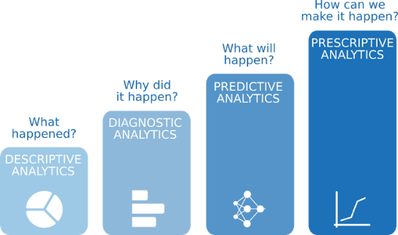

<style>
body {
text-align: justify}
</style>

```{r setup, include=FALSE}
knitr::opts_chunk$set(eval=T, echo=T)
```


******
# Detalles de la actividad
******
## Decripción

A lo largo de esta práctica se ha realizado un caso práctico sobre el estudio de los datasets Red/White Wine Quality con el fin de aprender a identificar los datos relevantes de un proyecto analítico, así como utilizar las técnicas apropiadas para la integración, limpieza, validación y análisis de los datos.

## Competencias

A continuación, se muestran las competencias desarrolladas en esta práctica del Máster de Data Science.  
* Capacidad de analizar un problema en el nivel de abstracción adecuado a cada situación y aplicar las habilidades y conocimientos adquiridos para abordarlo y resolverlo.  
* Capacidad para aplicar las técnicas específicas de tratamiento de datos (integración, transformación, limpieza y validación) para su posterior análisis.  


## Objetivos

Como se especifica en el enunciado de esta práctica, los objetivos son los siguientes:

* Aprender a aplicar los conocimientos adquiridos y su capacidad de resolución de problemas en entornos nuevos o poco conocidos dentro de contextos más amplios o multidisciplinares.  
* Saber identificar los datos relevantes y los tratamientos necesarios (integración, limpieza y validación) para llevar a cabo un proyecto analítico.  
* Aprender a analizar los datos adecuadamente para abordar la información contenida en los datos.  
* Identificar la mejor representación de los resultados para aportar conclusiones sobre el problema planteado en el proceso analítico.  
* Actuar con los principios éticos y legales relacionados con la manipulación de datos en Tipología y ciclo de vida de los datos Práctica 2 pág 2 función del ámbito de aplicación. 
* Desarrollar las habilidades de aprendizaje que les permitan continuar estudiando de un modo que tendrá que ser en gran medida autodirigido o autónomo.  
* Desarrollar la capacidad de búsqueda, gestión y uso de información y recursos en el ámbito de la ciencia de datos.  


## Nota: Propiedad intelectual 

> A menudo es inevitable, al producir una obra multimedia, hacer uso de recursos creados por terceras personas. Es por lo tanto comprensible hacerlo en el marco de una práctica de los estudios de Informática, Multimedia y Telecomunicación de la UOC, siempre y cuando esto se documente claramente y no suponga plagio en la práctica. 

> Por lo tanto, si se hicera uso de recursos ajenos, se presentará un documento detallando y especificando el nombre de cada recurso, su autor, el lugar dónde se obtuvo y su estatus legal: si la obra está protegida por el copyright o se acoge a alguna otra licencia de uso (Creative Commons, licencia GNU, GPL ...). 
Como autores de la práctica nos aseguraremos que la licencia  no impide específicamente su uso en el marco de la práctica. En caso de no encontrar la información correspondiente tendrá que asumir que la obra está protegida por copyright. 


******
# Resolución
******

## Introducción

### Descripción del dataset

Como ya hemos comentado anteriormente, para el desarrollo de la práctica se ha analizado los datasets Red/White Wine Quality que podemos encontrar en UCI Machine Learning Repository. En estos ficheros cada registro representa un ensayo de calidad fisicoquímico sobre un determinado vino en base a una serie de atributos. Ambos ficheros presentan la misma configuración y el mismo número de atributos y registros como se muestra a continuación.


| Formato | CSV |
|---------|-----|
| Separador | ; |
| Header | True |
| Número de registros | 4898 |
| Número de atributos | 12 |

A continuación, se muestra una descripción de los atributos de los ficheros en estudio.

| Nombre               | Descripción                            | Tipo     |
|----------------------|----------------------------------------|----------|
| fixed acidity        | Acidez fija                            | Numérico |
| volatile acidity     | Acidez volátil                         | Numérico |
| citric acid          | Ácido cítrico                          | Numérico |
| residual sugar       | Azúcar residual                        | Numérico |
| chlorides            | Cloruros                               | Numérico |
| free sulfur dioxide  | Dióxido de azufre libre                | Numérico |
| total sulfur dioxide | Dióxido de azufre total                | Numérico |
| density              | Densidad                               | Numérico |
| pH                   | PH                                     | Numérico |
| sulphates            | Sulfatos                               | Numérico |
| alcohol              | Porcentaje de alcohol en volumen       | Numérico |
| quality              | Valor de calidad resultante del ensayo | Numérico |


El primer paso antes de realizar el análisis será unir ambos datasets para crear un único conjunto de datos.

### Importancia y objetivos del análisis

El objetivo es realizar un análisis completo del dataset de modo que trabajemos todas las fases de la analítica avanzada.

```{r, out.width = "50%", fig.align="center", fig.retina = 2, echo=FALSE, fig.cap="Tipos de análisis", chunck1}
library(knitr)

```


* Análisis descriptivo. Nos permite responder a la pregunta ¿Qué ha pasado? En otras palabras, nos ofrece un resumen de los datos históricos.
* Análisis de diagnóstico. Nos permite responder a la pregunta ¿Por qué ha pasado? En esta fase se identifican las relaciones entre las variables en estudio.
* Análisis predictivo. Nos permite responder a la pregunta ¿Qué pasará? En esta fase se generan los modelos y se validan.
* Análisis prescriptivo. Nos permite responder a la pregunta ¿Cómo podemos hacer que pase? Se aplica el modelo a una situación real para buscar puntos óptimos y responder a preguntas estratégicas para el diseño de nuevos productos.


## Análisis del dataset

### Instalación de librerías necesarias para exportar

```{r echo=TRUE, message=FALSE, warning=FALSE, chunck2}
library(readr) # Providing a fast and friendly way to read rectangular data ('csv'). 
library(knitr) # A General-Purpose Package for Dynamic Report Generation in R.
library(tinytex) # Helper Functions to Install and Maintain 'TeX Live', and Compile 'LaTeX' Documents. 
library(kableExtra) # Construct Complex Table with 'kable' and Pipe Syntax. Build complex HTML or 'LaTeX' tables 
library(tidyverse) # Collection of R packages designed for data science.
library(scales) # Graphical scales map data to aesthetics, and provide methods for automatically determining breaks and labels for axes
library(dplyr) # tool for working with data frame like objects, both in memory and out of memory.
library(tables) # Computes and displays complex tables of summary statistics
library(ggplot2) # A system for 'declaratively' creating graphics, based on "The Grammar of Graphics"
library(ggExtra) # Package for adding marginal histograms to ggplot2
library(magrittr) # Provides a mechanism for chaining commands with a new forward-pipe operator, %>%. 
library(corrplot) # The corrplot package is a graphical display of a correlation matrix, confidence interval....
library(grid) # grid adds an nx by ny rectangular grid to an existing plot.
library(gridExtra) # Provides a number of user-level functions to work with "grid" graphics, notably to arrange multiple grid-based plots on a page, and draw tables. 
library(visdat) # Create preliminary exploratory data visualisations of an entire dataset to identify problems or unexpected features using 'ggplot2'.
library(moments) # Compute skewness of a univariate distribution.
library(caret) # Pre-processing transformation (centering, scaling etc.) can be estimated from the training data and applied to any data set with the same variables.
library(nortest) # Performs the Lilliefors (Kolmogorov-Smirnov) test for the composite hypothesis of normality,
library(car) # VIF Regression: A Fast Regression Algorithm For Large Data
```


### Análisis Descriptivo

En primer lugar vamos a proceder a cargar ambos archivos. En este caso se han extraído directaemnte de la url, de modo que no tengan que pasar por nuestro dispositivo, optimizando el proceso. No obstante, se adjunta la línea de código comentada para cargar los archivos desde la carpeta raíz, por si hubiera alguna modificación de la url.
```{r message=FALSE, warning=FALSE, chunck3}
# Se carga el primer conjunto de datos
white_url <- "https://archive.ics.uci.edu/ml/machine-learning-databases/wine-quality/winequality-white.csv"
whitewine <- read.csv(white_url, header = TRUE, sep = ";")
# whitewine <- read.csv(winequality-white.csv, header = TRUE, sep = ";")

# Se carga el segundo conjunto de datos
red_url <- "https://archive.ics.uci.edu/ml/machine-learning-databases/wine-quality/winequality-red.csv"
redwine <- read.csv(white_url, header = TRUE, sep = ";")
#redwine <- read.csv(winequality-red.csv, header = TRUE, sep = ";")

#Añadimos una nueva columna con el color del vino antes de unir los dos conjuntos de datos.
whitewine$color<-"white"
redwine$color<-"red"
```

Unión de los conjuntos de datos
```{r echo=TRUE, message=FALSE, warning=FALSE, chunck4}
# Mediante la función rbind se unen (join) verticalmente los conjuntos de datos
wine <- rbind(redwine, whitewine)
```


Empezaremos haciendo un breve análisis de los datos ya que nos interesa tener una idea general de los datos que disponemos. Por ello, primero calcularemos las dimensiones de nuestra base de datos y analizaremos qué tipos de atributos tenemos.

Para empezar, calculamos las dimensiones mediante la función dim(). Obtenemos que disponemos de 9796 registros (filas) y 13 variables (columnas). 
```{r echo=TRUE, message=FALSE, warning=FALSE, chunck5}
# Dimensiones de la base de datos
dim(wine)
# Estructura de los datos
str(wine)
```

Una vez cargados los datos, vamos a verificar la transmisión de la información.
```{r echo=TRUE, message=FALSE, warning=FALSE, chunck6}
# Hacemos una primera visualización
head(wine)
# Comprobamos el tipo de variable en los datos
sapply(wine,class)
# Mostramos un resumen de los datos originales
summary(wine)
```

Factorizamos la variable "color" para futuros análisis.
```{r echo=TRUE, message=FALSE, warning=FALSE, chunck7}
wine$color<-as.factor(wine$color)
```

Se eliminan los registros duplicados si los  hubiese
```{r echo=TRUE, message=FALSE, warning=FALSE, chunck8}
wine <- wine[!duplicated(wine), ]
dim(wine)
```

Comprobamos sie existen valores NA
```{r echo=TRUE, message=FALSE, warning=FALSE, chunck9}
vis_miss(wine)
```

Todos los valores están presentes. No existen valores NA.

Como podemos ver, todas las variables han sido identificadas con el tipo correspondiente y no se aprecian anomalías a simple vista en los datos.

### Análisis Descriptivo visual


```{r echo=TRUE, message=FALSE, warning=FALSE, chunck10}
attach(wine)
#Iniciamos el cuadrante para el gráfico
par(mfrow=c(1,2))

# Representamos histogramas y boxplot para las variables numéricas    
hist(fixed.acidity , main="fixed.acidity histogram")
boxplot(fixed.acidity, main="fixed.acidity boxplot")
hist(volatile.acidity , main="volatile.acidity histogram")
boxplot(volatile.acidity , main="volatile.acidity boxplot")
hist(citric.acid  , main="citric.acid histogram")
boxplot(citric.acid  , main="citric.acid boxplot")
hist(residual.sugar  , main="residual.sugar histogram")
boxplot(residual.sugar  , main="residual.sugar boxplot")
hist(chlorides  , main="chlorides histogram")
boxplot(chlorides  , main="chlorides boxplot")
hist(free.sulfur.dioxide  , main="free.sulfur.dioxide histogram")
boxplot(free.sulfur.dioxide  , main="free.sulfur.dioxide boxplot")
hist(total.sulfur.dioxide  , main="total.sulfur.dioxide histogram")
boxplot(total.sulfur.dioxide  , main="total.sulfur.dioxide boxplot")
hist(density  , main="density histogram")
boxplot(density  , main="density boxplot")
hist(sulphates  , main="sulphates histogram")
boxplot(sulphates  , main="sulphates boxplot")
hist(alcohol  , main="alcohol histogram")
boxplot(alcohol  , main="alcohol boxplot")
hist(quality  , main="quality histogram")
boxplot(quality  , main="quality boxplot")

# Representamos gráfico de barras de las variables nominales
barplot(table(color), main="Color histogram")
detach(wine)
```

Todas las variables presentan outliers.

* Quality tiene la mayoría de los valores concentrados en las categorías 5, 6 y 7. Sólo una pequeña proporción está en las categorías [3, 4] y [8, 9] y ninguna en las categorías [1, 2, 10].  
* Fixed acidity, volatile.acidity y citric.acid  tienen valores atípicos. Si se eliminan esos valores atípicos, la distribución de las variables puede considerarse simétrica. 
* Residual.sugar residual tiene una distribución positivamente sesgada; incluso después de eliminar los valores atípicos, la distribución seguirá siendo sesgada. 
* Algunas de las variables, por ejemplo, free.sulphur.dioxide y density,, tienen unos pocos valores atípicos, pero éstos son muy diferentes del resto. 
* Alcohol tiene una distribución irregular pero no tiene valores atípicos pronunciados. 

### Comprobación de la asimetría

Comprobamos a continuación la asimetría de las variables verificar si los datos se distribuyen normalmente o no.
```{r echo=TRUE, message=FALSE, warning=FALSE, chunck11}
attach(wine)
skewness(fixed.acidity)
skewness(volatile.acidity)
skewness(citric.acid)
skewness(residual.sugar)
skewness(chlorides)
skewness(free.sulfur.dioxide)
skewness(total.sulfur.dioxide)
skewness(density)
skewness(pH)
skewness(sulphates)
skewness(alcohol)
skewness(quality)
detach(wine)
```

Regla de la asimetría:

* Si la asimetría es 0, los datos son perfectamente simétricos. 
* Si la asimetría es menor que -1 o mayor que 1, la distribución es altamente sesgada. 
* Si la asimetría está entre -0,5 y 0,5, la distribución es aproximadamente simétrica. 

Fuente:*[GoodData.Documentation](https://help.gooddata.com/doc/en/reporting-and-dashboards/maql-analytical-query-language/maql-expression-reference/aggregation-functions/statistical-functions/predictive-statistical-use-cases/normality-testing-skewness-and-kurtosis)


### Transformación de las variables 

Se aplica transformación de Boxcox y volvemos a comprobar la asimetría.

Fuente: *[Box-Cox Transformations](http://onlinestatbook.com/2/transformations/box-cox.html)

```{r echo=TRUE, message=FALSE, warning=FALSE, chunck12}
wine_procesado <- preProcess(wine[,1:11], c("BoxCox", "center", "scale"))
new_wine <- data.frame(trans = predict(wine_procesado, wine))

colnames(new_wine)
```

```{r echo=TRUE, message=FALSE, warning=FALSE, chunck13}
attach(new_wine)
skewness(trans.fixed.acidity)
skewness(trans.volatile.acidity)
skewness(trans.citric.acid)
skewness(trans.residual.sugar)
skewness(trans.chlorides)
skewness(trans.free.sulfur.dioxide)
skewness(trans.total.sulfur.dioxide)
skewness(trans.density)
skewness(trans.quality)
skewness(trans.pH)
skewness(trans.sulphates)
skewness(trans.alcohol)
detach(new_wine)
```

Ahora la mayoría las distribuciones son aproximadamente simétricas (la asimetría está entre -0,5 y 0,5). Las únicas variables que muestran aún una asimestría son:  
* trans.citric.acid
* trans.density

Se va a realizar ejemplarmente una comprobación de la normalidad para la variable trans.citric.acid.

```{r echo=TRUE, message=FALSE, warning=FALSE, chunck14}
# Para comprobar la normalidad de la variable trans.citric.acid se va a usar:
# 1. Gráfico de cuantiles teóricos (Gráficos Q-Q): Consiste en comparar los cuantiles de la distribución observada con los cuantiles teóricos de una distribución normal con la misma media y desviación estándar que los datos. Cuanto más se aproximen los datos a una normal, más alineados están los puntos entorno a la recta.
# 2. Un histograma
# 3. Diagrama de cajas
par(mfrow = c(1, 3)) 
hist(new_wine$trans.citric.acid, las=1, main="Distribución normal", font.main=1, ylab="Frecuencia", xlab = "trans.citric.acid") 
qqnorm(new_wine$trans.citric.acid, las=1, pch=18, main="Simetria", font.main=1, xlab="Cuantiles teóricos", ylab="Cuantiles muestrales") 
qqline(new_wine$trans.citric.acid) 
boxplot(new_wine$trans.citric.acid, las=1, main="Valores extremos", font.main=1, xlab="Datos de distribution normal", horizontal=F)
```

No se trata de una distribución normal ya que presenta una asimetría en ambas colas, aunque la cola a la derecha de la media es más larga que la izquierda.

Para asegurarnos completamente se realiza la pruena de Lilliefors (Kolmogorov-Smirnov) para muestras grandes (n>50).  
El test Lilliefors asume que la media y varianza son desconocidas, estando especialmente desarrollado para contrastar la normalidad.  
Es la alternativa al test de Shapiro-Wilk cuando el número de observaciones es mayor de 50. La función lillie.test() del paquete nortest permite aplicarlo.

__Planteamos la Hipótesis:__

$\ H_0:$ La muestra proviene de una distribución normal.  
$\ H_1:$ La muestra no proviene de una distribución normal.

__Nivel de significancia:__
El nivel de significancia que se trabajará es de 0.05. $\alpha=0.05$

__Criterio de decisón:__

Si $p<\alpha$ se rechaza $\ H_0:$  
Si $p>\alpha$ no se rechaza $\ H_0:$
 

```{r echo=TRUE, message=FALSE, warning=FALSE, chunck15}
lillie.test(x=new_wine$trans.citric.acid)
```

Dado que $p-value<\alpha$ se rechaza $\ H_0:$. La muestra no proviene de una distribución normal. Pero, puesto que el tamaño de la muestra es mayor a 30, según el teorema del límite central, asumimos la normalidad.

### Eliminación de los Outliers


Procedemos a eliminar los valores outliers encontardos en los gráficos boxplot anteriores.
```{r echo=TRUE, message=FALSE, warning=FALSE, chunck16}
# Mostramos los valores identificados como outliers
attach(new_wine)
f_a_out<-boxplot.stats(trans.fixed.acidity)$out
v_a_out<-boxplot.stats(trans.volatile.acidity)$out
c_a_out<-boxplot.stats(trans.citric.acid)$out
r_s_out<-boxplot.stats(trans.residual.sugar)$out
ch_out<-boxplot.stats(trans.chlorides)$out
f_s_d_out<-boxplot.stats(trans.free.sulfur.dioxide)$out
t_s_d_out<-boxplot.stats(trans.total.sulfur.dioxide)$out
d_t_out<-boxplot.stats(trans.density)$out
ph_out<-boxplot.stats(trans.pH )$out
sh_out<-boxplot.stats(trans.sulphates)$out
ac_out<-boxplot.stats(trans.alcohol)$out
qa_out<-boxplot.stats(trans.quality)$out
detach(new_wine)
```


Las variables trans.alcohol, trans.residual.sugar y trans.color no presentan outliers. 
```{r echo=TRUE, message=FALSE, warning=FALSE, chunck17}
# Eliminamos las instancias con outlier
new_wine<-new_wine[-which(new_wine$trans.fixed.acidity %in% f_a_out),]
new_wine<-new_wine[-which(new_wine$trans.volatile.acidity %in% v_a_out),]
new_wine<-new_wine[-which(new_wine$trans.citric.acid %in% c_a_out),]
new_wine<-new_wine[-which(new_wine$trans.chlorides %in% ch_out),]
new_wine<-new_wine[-which(new_wine$trans.free.sulfur.dioxide %in% f_s_d_out),]
new_wine<-new_wine[-which(new_wine$trans.total.sulfur.dioxide %in% t_s_d_out),]
new_wine<-new_wine[-which(new_wine$trans.density %in% d_t_out),]
new_wine<-new_wine[-which(new_wine$trans.pH %in% ph_out),]
new_wine<-new_wine[-which(new_wine$trans.sulphates %in% sh_out),]
new_wine<-new_wine[-which(new_wine$trans.quality %in% qa_out),]
```


### Análisis de diagnóstico

Tras haber eliminado los valores atípicos, revisamos la correlación entre las distintas variables. El objetivo es centrar el análisis descriptivo en aquellas variables que presentan correlación.
```{r echo=TRUE, message=FALSE, warning=FALSE, chunck18}
#Se omite la variable color para pocer representar la matriz de correlación
corrplot(cor(new_wine[1:12]))
```

Las correlaciones positivas se muestran en azul y las negativas en rojo. La intensidad del color y el tamaño del círculo son proporcionales a los coeficientes de correlación. En la parte derecha del correlograma, el color de la leyenda muestra los coeficientes de correlación y los colores correspondientes.

Observando los resultados se verifica que:  
1. La calidad del vino no se encuentra correlacionada con las variables "citric.acid", "free.sulfur.dioxide", los "sulphates" y "color".
2. Es coherente la alta correlación positiva entre free.sulfur.dioxide y total.sulfur.dioxide. A mayor cantidad de sulfuro más sulfuro libre hay.
3. Es coherente la alta correlación negativa entre fixed.acidity  y PH. Cuanto mayor es el PH en la escala de ácido-base más básico es el compuesto.Por lo tanto a valores altos de PH menor es la acidez.
4. Es coherente la alta correlación negativa entre el azucar y el alcohol.El alcohol es el resultado de la oxidación del azucar, por tanto si hay menos azucar el grado de alcohol aumenta. 

A continuación se estudian visaulamente las posibles correlaciones entre:

###  Variables residual.sugar y density
```{r echo=TRUE, message=FALSE, warning=FALSE, chunck19}
# Calculamos la correlación y la mostramos por pantalla
RS_D_cor = cor(new_wine$trans.residual.sugar,new_wine$trans.density)
print(RS_D_cor)
# Generamos el scatter plot y añadimos la linea de regresión para una mejor visualización
plot(new_wine$trans.residual.sugar,new_wine$trans.density, main="residual.sugar vs density",xlab="residual.sugar", ylab="density", pch=19)
abline(lm(new_wine$trans.density~new_wine$trans.residual.sugar), col="red") # regression line (y~x)
```

Como podemos apreciar en la gráfica existe una fuerte relación lineal entre ambas variables y todos los puntos se ajustan bastante bien a la linea. El resultado de la correlación, 0.75, refuerza lo comentado anteriormente.

### Variables density y alcochol
```{r echo=TRUE, message=FALSE, warning=FALSE, chunck20}
# Calculamos la correlación y la mostramos por pantalla
D_A_cor = cor(new_wine$trans.density,new_wine$trans.alcohol)
print(D_A_cor)
# Generamos el scatter plot y añadimos la linea de regresión para una mejor visualización
plot(new_wine$trans.density,new_wine$trans.alcohol, main="alcochol vs density",xlab="alcochol", ylab="density", pch=19)
abline(lm(new_wine$trans.alcohol~new_wine$trans.density), col="red") # regression line (y~x)
```

Al igual que antes, existe una fuerte relación lineal entre ambas variables y los puntos se ajustan a la linea. El resultado de la correlación, -0.80, refuerza lo comentado anteriormente.

### Todas las variables y quality

```{r echo=TRUE, message=FALSE, warning=FALSE, chunck21}
# Calculamos la correlación y la mostramos por pantalla
par(mfrow = c(1,2))
for (i in c(1:11)) {
    plot(new_wine[, i], jitter(new_wine[, "trans.quality"]), xlab = names(new_wine)[i],
         ylab = "trans.quality", col = "firebrick", cex = 0.8, cex.lab = 1.3)
    abline(lm(new_wine[, "trans.quality"] ~ new_wine[ ,i]), lty = 2, lwd = 2)
}
par(mfrow = c(1, 1))
```

Las variables trans.alcohol, trans.sulphates y trans.pH parecen tener una correlación positiva con trans.quality, mientras que ltrans.volatile.acidity, trans.chlorides y trans.total.sulfur.dioxidel parecen tener una relación negativa con la calidad.

### Contraste de hipótesis para la diferencia de medias

Dado que nuestro dataset contiene los valores para los vinos blancos y tintos, vamos a realizar un contraste de hipótesis para la diferencia de medias (trans.citric.acid) de las dos muestras. Planteamos la sigueinte hipótesis:  
¿Podemos aceptar con un nivel de confianza del 95% que los vinos blancos (color) tienen una acidez (trans.citric.acid) que supera a la acidez de los vinos tintos (color)?.


Planteamos la Hipótesis nula y alternativa
$$
\left\{
\begin{array}{ll}
H_{0}: &  \mu_{si}=\mu_{no}\\
H_{1}: & \mu_{si}>\mu_{no}
\end{array}
\right.\\
\ Hipótesis\ unilateral\ a \ la \ dereccha
$$


EL método que se aplica es un contraste de hipótesis para dos muestras independientes. El test es paramétrico, asumiendo el teorema del límite central. Es un test unilateral, con varianzas desconocidas, pero iguales, ya que el test de varianzas no rechaza la hipótesis nula de varianzas iguales.
```{r echo=TRUE, message=FALSE, warning=FALSE, chunck22}
#Test de igualdad de varianzas
#H0: F (ratio de varianzas) = 1
#H1: F diferente de 1
var.test(new_wine$trans.citric.acid[new_wine$trans.color=="white"], new_wine$trans.citric.acid[new_wine$trans.color=="red"],
         alternative = "greater")
```


A continuación se lleva a cabo el contraste de hipótesis:
```{r echo=TRUE, message=FALSE, warning=FALSE, chunck23}
#Se define una función myttest.
#x1, x2: muestras
#CL: confidence level (nivel de confianza)
#equalvar TRUE/FALSE
#alternative: "bilateral", "less" (x1 less than x2), "greater" (x1 greater than x2).
myttest <- function( x1, x2, CL=0.95,equalvar=TRUE, alternative="bilateral" ){ # z test
  mean1<-mean(x1)
  n1<-length(x1)
  sd1<-sd(x1)
  mean2<-mean(x2) 
  n2<-length(x2) 
  sd2<-sd(x2)
  
if (equalvar==TRUE){
  s <-sqrt( ((n1-1)*sd1^2 + (n2-1)*sd2^2 )/(n1+n2-2) ) 
  Sb <- s*sqrt(1/n1 + 1/n2)
  df<-n1+n2-2
}
else{ #equalvar==FALSE
  Sb <- sqrt( sd1^2/n1 + sd2^2/n2 )
  denom <- ( (sd1^2/n1)^2/(n1-1) + (sd2^2/n2)^2/(n2-2)) 
  df <- ((sd1^2/n1 + sd2^2/n2)^2) / denom
}
alfa <- (1-CL)
t<- (mean1-mean2) / Sb

if (alternative=="bilateral"){
  tcritical <- qt( alfa/2, df, lower.tail=FALSE ) #two sided 
  pvalue<-pt( abs(t), df, lower.tail=FALSE )*2 #two sided
}
else if (alternative=="less"){
  tcritical <- qt( alfa, df, lower.tail=TRUE )
  pvalue<-pt( t, df, lower.tail=TRUE ) 
}

else{ #(alternative=="greater")
  tcritical <- qt( alfa, df, lower.tail=FALSE ) 
  pvalue<-pt( t, df, lower.tail=FALSE )
}
  #Guardamos en resultado en un data frame
info<-data.frame(t,df,tcritical,pvalue) 
info %>% kable() %>% kable_styling() 
return (info)
}
```

Se visualizan tanto el estadístico como el valor p:
```{r echo=TRUE, message=FALSE, warning=FALSE, chunck24}
info<-myttest( new_wine$trans.citric.acid[new_wine$trans.color=="white"], 
               new_wine$trans.citric.acid[new_wine$trans.color=="red"], 
               alternative="less",
               equalvar="TRUE")

info 
```

Dado que hemos aplicado una función propia comprobamos el resultado con la fución original de R.
```{r echo=TRUE, message=FALSE, warning=FALSE, chunck25}
#Comparación con t.test de R
t.test( new_wine$trans.citric.acid[new_wine$trans.color=="white"], new_wine$trans.citric.acid[new_wine$trans.color=="red"], alternative = "less",
        var.equal = TRUE)
```

El valor p es 0.5, mayor que el nivel de significación es 0.05 (95%). **No podemos rechazar la hipótesis nula** de igualdad de acidez media entre los vinos blancos y tintos. En otras palabras, no podemos asumir que la media de acidez de vinos blancos sea mayor a la de vinos tintos.

### Contraste de hipótesis para la relación entre variables


* Hipótesis nula: H<sub>0</sub>: La variable trans.color y la variable trans.quality son independientes.
* Hipótesis alternativa: H<sub>1</sub>: La variable trans.color y la variable trans.quality no son independientes.


Realizad los cálculos manualmente del test. Para ello, se recomienda construir una función my.chisq que realice estos cálculos y que podáis reusar más adelante.

```{r echo=TRUE, message=FALSE, warning=FALSE, chunck26}
# Realizamos el test con la función chisq.test para comprobar los resultados.
chisq.test(new_wine$trans.color,new_wine$trans.quality)
```

El valor crítico es mayor que el chi-cuadrado, por tanto, no podemos rechazar la hipótesis nula de que las variables son independientes.

Del mismo modo, el p valor es mayor al nivel de confianza 0.05 por tanto también debemos aceptar la hipótesis nula y podemos afirmar que no hay una dependencia entre el color y si la calidad del vino con un 95% de confianza. 

### Análisis predictivo

Vamos a aplicar un modelo de regresión lineal multivariable. El objetivo consistirá en predecir la calidad del vino en función de las otras variables.

Antes de elegir el mejor modelo lineal vamos a dividir el conjunto de datos en dos:  
1. Set de entrenamiento  
2. Set de prueba
```{r echo=TRUE, message=FALSE, warning=FALSE, chunck27}
set.seed(100)
#new_wine$trans.color<-as.numeric(new_wine$trans.color)
trainingRowIndex <- sample(1:nrow(new_wine), 0.8*nrow(new_wine))  
new_wine_train <- new_wine[trainingRowIndex, ]  
new_wine_test  <- new_wine[-trainingRowIndex, ]  
```


Realizamos el primer modelo
```{r echo=TRUE, message=FALSE, warning=FALSE, chunck28}
# Incluimos todas las variables 
modelo_1 <- lm(trans.quality ~ . , new_wine_train) 
summary(modelo_1)
```

Todas las variables presentan significación muy alta, esto puede ser consecuencia de **multicolinealidad** entre las variables. Para detectarla y minimizarla vamos a seguir los siguientes pasos:

1. Análisis de la multicolinealidad  
2. Modelo con variables que no muestran colinealidad  
3. Análisis de la multicolinealidad
4. Modelo con variables más significativas
4. Predicción de valores
5. Matriz de confusión

**Multicolinealidad**: Se dice que existe multicolinealidad entre las variables explicativas cuando existe algún tipo de dependencia lineal entre ellas, o lo que es lo mismo, si existe una fuerte correlación entre las mismas. La correlación no solamente se refiere a las distintas variables dos a dos, sino a cualquier de ellas con cualquier grupo de las restantes. Por esta razón no es suficiente (aunque sí necesaria) que en la matriz de correlaciones bivariadas haya correlaciones altas.

El principal inconveniente de la multicolinealidad consiste en que se incrementan la varianza de los coeficientes de regresión estimados hasta el punto que resulta prácticamente imposible establecer su significación estadística, ya que como se sabe, el valor de t para un determinado coeficiente de regresión es el valor de dicho coeficiente dividido por su desviación tipica. Si este es grande, el valor de t será bajo y no llegara a la significación.

Hay varios procedimientos para detectar la multicolinealidad entre los predictores. El primero de ellos, basado en la correlación múltiple de un determinado regresor con los restantes se denomina Tolerancia de dicho regresor. Su valor es $\ 1-R^2_i$. Siendo $\ R^2_i$ la correlación múltiple al cuadrado de dicho regresor con los restantes.

Para que haya multicolinealidad dicha correlación ha de ser alta, o lo que es lo mismo la tolerancia baja.

Otro índice relacionado con éste y que nos da una idea del grado de aumento de la varianza se denomina Factor de Inflación de la Varianza, y es precisamente el recíproco de la tolerancia. Su valor es: $\ VIF=1/(1-R^2_y)$. Para que no haya multicolinealidad el denominador tiene que valer cerca de la unidad, por tanto un poco más de 1 el valor de VIF. **Cuanto mayor sea de este valor mayor multicolinealidad habrá y por tanto más inestable es el modelo lineal**; en otras palabras, es conveniente eliminar del modelo las variables con un factor VIF grande.

Si todos los VIF son 1, no hay multicolinealidad, pero si algunos VIF son mayores que 1, los predictores están correlacionados. Cuando un VIF es > 5, el coeficiente de regresión para ese término no se estima adecuadamente.

Fuentes: 
*[REGRESIÓN LINEAL MÚLTIPLE](https://personal.us.es/vararey/adatos2/multiple.pdf)  
*[Multicolinealidad](https://www.uv.es/uriel/material/multicolinealidad3.pdf)

Analizamos la multicolinealidad mediante el análisis del valor VIF
```{r echo=TRUE, message=FALSE, warning=FALSE, chunck29}
vif(modelo_1)
```

Se observa multicolinealidad en la variable trans.density y se procede a eliminarla del modelo.  
Ajustamos el modelo de nuevo
```{r echo=TRUE, message=FALSE, warning=FALSE, chunck30}
# excluímos la variable trans.density
modelo_2 <- lm(trans.quality ~ . -trans.density, new_wine_train) 
summary(modelo_2)
```

Analizamos la multicolinealidad mediante el análisis del valor VIF
```{r echo=TRUE, message=FALSE, warning=FALSE, chunck31}
vif(modelo_2)
```

Los valores VIF son menores de 5 para todas las variables, en otras palabras la colinealidad es muy baja con el modelo 2.

Ajustamos un modelo nuevo con las variables que presentan significación:
```{r echo=TRUE, message=FALSE, warning=FALSE, chunck32}
modelo_3 <- lm(trans.quality ~  trans.volatile.acidity +trans.free.sulfur.dioxide +trans.alcohol , new_wine_train) 
summary(modelo_3)
```

Los valores VIF son menores de 1.1 para todas las variables, en otras palabras la no hay colinealidad en el modelo 3.
```{r echo=TRUE, message=FALSE, warning=FALSE, chunck33}
vif(modelo_3)
```

### Análisis prescriptivo

Predecimos valores utilizando el set de prueba
```{r echo=TRUE, message=FALSE, warning=FALSE, chunck34}
# Se redondea el resultado para eliminar los decimales en la predicción
modelo_3_Pred = round(predict(modelo_3, newdata=new_wine_test))
head(modelo_3_Pred)
```

Creamos la matriz de confusión para comprobar la precisión del modelo. Se enfrentan los valores predichos por el modelo con los valores reales del set de prueba.
```{r echo=TRUE, message=FALSE, warning=FALSE, chunck35}
confusionMatrix(table(modelo_3_Pred, new_wine_test$trans.quality))
```

Nuestro modelo tiene una precisión del 52.23%

Diagnosticamos el modelo a continuación
```{r echo=TRUE, message=FALSE, warning=FALSE, chunck36}
#Revisamos los residuos para asegurar que están distribuidos normalmente
hist(modelo_3$residuals)

#Comprobamos la media de los residuos para asegurarnos que ésta se encuentra cerca de 0
mean(modelo_3$residuals)

#Visualizamos los diagramas
layout(matrix(c(1,2,3,4),2,2))
plot(modelo_3)
```

Tras examinar los resultados podemos afirmar:
* Se satisface la condición de linealidad.  
* El análisis gráfico confirman la normalidad.  
* No hay evidencias de falta de homocedasticidad.   
* No hay multicolinialidad.  

# Archivo preprocesado

Para finalizar se genera un archivo con el conjunto de datos procesado para análisis posteriores.
```{r echo=TRUE, message=FALSE, warning=FALSE, chunck37}
# Guardamos los datos
write.csv(new_wine, file="Wine_clean.csv",row.names=F)
```


# Repositorio

A continuación se muestra la dirección de acceso al repositorio, donde podemos encontrar el código fuente, el archivo original, el archivo preprocesado y el documento html (RMarkdown).

https://github.com/SevillaFe/DataCleaning_DataAnalysis_UOC


# Tabla de contribuciones y referencias

Tanto la la tabla de contribuciones como las referncias utilizadass durante esta práctica, se encuentran disponibles en la wiki del repositorio.

